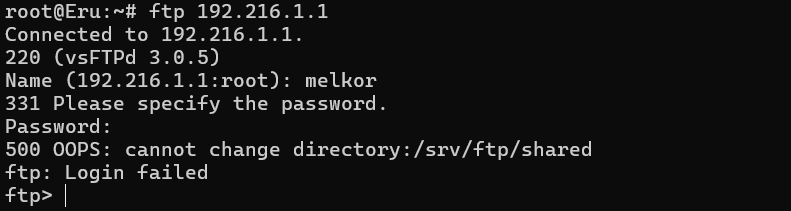

# lapres-jarkom-modul1-k10
## Anggota
| Nama                      | NRP        |
| --------------------------| ---------- |
| Bayu Kurniawan            | 5027241055 |
| Ica Zika Hamizah          | 5027241058 |

## Pembahasan soal
### Nomor 1
Pertama buat rangkaian, seperti dibawah ini


### Nomor 2
Config Eru sebagai router ke switch 1 dan switch 2
```
auto eth0
iface eth0 inet dhcp

auto eth1
iface eth1 inet static
    address 192.216.1.1
    netmask 255.255.255.0

auto eth2
iface eth2 inet static
    address 192.216.2.1
    netmask 255.255.255.0
```

lalu tambahkan config ke /root/.bashrc
```
apt update && apt install -y iptables
iptables -t nat -A POSTROUTING -o eth0 -j MASQUERADE -s 192.216.0.0/16
echo "nameserver 192.168.122.1" > /etc/resolv.conf
```

### Nomor 3
Setiap perangkat harus punya ip, config masing masing client dulu

- Melkor
```
auto eth0
iface eth0 inet static
    address 192.216.1.2
    netmask 255.255.255.0
    gateway 192.216.1.1
```

- Manwe
```
auto eth0
iface eth0 inet static
    address 192.216.1.3
    netmask 255.255.255.0
    gateway 192.216.1.1
```

- Varda
```
auto eth0
iface eth0 inet static
    address 192.216.2.2
    netmask 255.255.255.0
    gateway 192.216.2.1
```

- Ulmo
```
auto eth0
iface eth0 inet static
    address 192.216.2.3
    netmask 255.255.255.0
    gateway 192.216.2.1
```

### Nomor 4
Semua client terhubung ke internet, agar terhubung jalankan
`echo "nameserver 192.168.122.1" > /etc/resolv.conf`

Cek dengan ping google, jika berhasil maka sudah tersambung ke internet dan cek `ip a` pastikan ip sudah benar di masing-masing client

### Nomor 5
edit `/root/.bashrc`, isi dengan config seperti apt update, apt install sesuai kebutuhan. Agar jika di restart package yang di download tidak hilang

### Nomor 6
Masuk ke manwe dengan cara `telnet 10.15.43.32 port`

Lalu download file yang sudah disediakan (traffic.sh).
Setelah terdownload jangan lupa di unzip lalu ubah permissionnya dulu agar bisa di execute. Setelah itu, jalankan filenya dan jangan lupa capture dengan wireshark


MASUKIN HASIL CAPTURE WIRESHARK

### Nomor 7
Pertama buat dulu 2 user baru yaitu ainur dan malkor, ainur bisa mengakses folder shared sedangkan malkor tidak bisa mengakses folder shared.


Setelah user berhasil dibuat, buat folder shared seperti gambar dibawah.
gunakan `usermod` untuk langsung menuju folder tujuan, jadi ketika d=kedua user login, akan diarahkan langsung ke `/srv/ftp/shared`.
Lalu ubah permission owner dengan `chown` agar ainur bisa membaca dan menulis di folder `shared`.
Buat permission folder shared menjadi 700, artinya hanya owner yang bisa mengakses folder `shared`.

Lalu buat file untuk mengetes apakah user ainur bisa read and write. Buat file di folder shared dan buat juga di root.


Coba login dengan user ainur, dan tes dengan `put` dan `get`.
Seperti gambar dibawah, ainur bisa read dan write di folder shared


Lalu coba login dengan user melkor, dan ternyata user tidak bisa login. karena suda di set tujuan setelah login langsung masuk ke folder `shared`, maka login langsung ditolak, artinya melkor tidak bisa read dan write di folder tersebut sesuai dengan ketentuan soal.


### Nomor 8
Pertama download dulu file `ramalan-cuaca.zip` di ulmo (maaf di gambar 'elmo' karena salah ketik) lalu unzip.

Lalu masuk di eru untuk start ftp dengan command berikut
`service vsftpd start`.

Kembali lagi ke elmo, lalu upload file yang sudah diekstrak tadi yakni `cuaca.txt` dan `mendung.jpg` menggunakan `put`.
Hasilnya bisa dilihat pada gambar dibawah, berhasil upload 2 file tersebut ke server ftp.


### Nomor 9
Pertama download dulu file di eru lalu start vsftpd-nya. Lalu aktifkan ftp dan upload file kitab_penciptaan.txt ke server.

Lalu pindah ke manwe dan jalankan ftp, login menggunakan user ainur lalu unduh file kitab_penciptaan.txt dari server.

Karena di soal diperintahkan untuk ubah akses agar ainur hanya bisa read, maka balik ke eru dan masukkan command `chmod 555 /srv/ftp/shared` lalu jangan lupa restart vsftpd.

Masuk ke ulmo lagi dan coba untuk upload file ke server, login dengan user ainur.

Hasilnya pasti failed, karena ainur memiliki akses read-only.


### Nomor 10
Melkor melakukan ping ke eru
`ping 192.216.1.1 -c 100`
Berikut hasilnya:


Analisis
- Packet Loss
Dari 100 paket yang dikirim, semua diterima (100 received). Jadi tidak ada packet loss (0%).

- Average Round Trip Time (RTT)
Nilai rata-rata RTT adalah 0.442 ms. Nilai ini tergolong sangat kecil → menunjukkan jaringan stabil.

- Dampak ke Eru
Karena tidak ada packet loss dan RTT tetap rendah, maka spam ping 100 paket tidak mempengaruhi kinerja Eru secara signifikan. Artinya server Eru masih bisa merespon normal meskipun mendapat banyak request ICMP dari Melkor.

### Nomor 11
Pertama download dulu package yang dibutuhkan yakni telnet
Lalu ubah confignya di file `/etc/inetd.conf`
cari bagian seperti ini, pastikan tidak ter-comment
```
telnet stream tcp nowait root /usr/sbin/tcpd /usr/sbin/telnetd
```
Selanjutnya coba login di eru dengan ip `telnet 192.216.1.2`. Lalu login sesuai user yang tadi di daftarkan, jika berhasil maka hasilnya seperti gambar dibawah ini.


Setelah setup siap, start atau restart openbsd-inetd, lalu masukkan user baru dengan menggunakan useradd di ssh. Lalu jangan lupa ubah passwordnya.


### Nomor 12
Pertama identifikasi port yang terbuka, port 21 ternyata memakai ftp dan port 80, 666 memakai apache2.

Download dulu ftp dan apache2 dengan command dibawah ini
```
apt install netcat-openbsd
service vsftpd start
```
Setelah itu start keduanya, cek port 21, 80, dan 666. Hasilnya seperti pada gambar bahwa port 21 dan 80 terbuka sedangkan 666 tertutup.


### Nomor 13
Untuk step pertama, download ssh dulu, jika sudah start servicenya.
lalu coba cari apakah ssh sudah menyala dan tersedia menggunakan command `netstat -tuln | grep :22`
Setelah itu, coba login menggunakan user ainur seperti dibawah ini.


### 14. Setelah gagal mengakses FTP, Melkor melancarkan serangan brute force terhadap  Manwe. Analisis file capture yang disediakan dan identifikasi upaya brute force Melkor. (link file) nc 10.15.43.32 3401

penyelesaian :
- gunakan display filter ‘http’ kemudian cari username dan password yang berhasil didapatkan dari brute force degnan cara mencari packet terakhir.

- gunakan Follow -> HTTP Stream untuk melihat informasi lainnya seperti username, password, credentials dll.


- dari informasi tersebut dapat digunakan untuk menyelesaikan soal yang ada.


### 15. Melkor menyusup ke ruang server dan memasang keyboard USB berbahaya pada node Manwe. Buka file capture dan identifikasi pesan atau ketikan (keystrokes) yang berhasil dicuri oleh Melkor untuk menemukan password rahasia. (link file) nc 10.15.43.32 3402

penyelesaian :
- gunakan filter '_ws.col.protocol == "USBHID"' untuk menampilkan report dari penggunaan USB. Dari payload kita bisa temukan bahwa device yang digunakan adalah Keyboard.


### 16. Melkor semakin murka ia meletakkan file berbahaya di server milik Manwe. Dari file capture yang ada, identifikasi file apa yang diletakkan oleh Melkor. (link file) nc 10.15.43.32 3403

penyelesaian :
- gunakan display filter ‘ftp’ untuk melacak file yang berbahaya dengan menggunakan Follow -> TCP Stream sehingga menampilkan informasi sebagai berikut.


- dari sana kita juga menemukan 5 file yang diduga mengandung malware. diantaranya:  q.exe, w.exe, e.exe, r.exe, dan t.exe

Dalam mode PASV FTP server mengirim tuple (a,b,c,d,p1,p2) di mana a.b.c.d adalah alamat IP dan p1/p2 adalah dua byte yang mewakili port 16-bit. Port TCP/UDP disimpan dalam dua byte: byte tinggi (high byte) dan byte rendah (low byte). Nilai numeriknya dihitung sebagai:

port = (high_byte * 256) + low_byte

contoh: kita ingin mencari port dimana file q.exe bisa didapatkan. kita bisa menggunakan perhitungan diatas sehingga didapatkan port dari hasil perhitungan dari persamaan berikut
q.exe — (...,199,145)

High_byte = 199, Low_byte = 145

port = 199 * 256 + 145

Jadi port = 51,089.

- gunakan port tersebut sebagai filter lalu pilih salah satu package dengan isi q.exe

- simpan file dengan cara Follow -> TCP Stream -> ganti tampilannya dari ASCII ke Raw -> simpan dengan nama file 'q.exe'

- lakukan hashing terhadap file tersebut sehingga mendapatkan hasil seperti gambar di bawah.


- ulangi tahap diatas pada file w.exe, e.exe, r.exe, dan t.exe.

- gunakan semua informasi yang ada untuk mendapatkan flag untuk soal ini.


### 17. Manwe membuat halaman web di node-nya yang menampilkan gambar cincin agung. Melkor yang melihat web tersebut merasa iri sehingga ia meletakkan file berbahaya agar web tersebut dapat dianggap menyebarkan malware oleh Eru. Analisis file capture untuk menggagalkan rencana Melkor dan menyelamatkan web Manwe. (link file) nc 10.15.43.32 3404

penyelesaian :
- gunakan display filter ‘http’ untuk mendapatkan package dengan protokol http, kita dapat menemukan file-file mencurigakan dengan cara melihatnya melalui file -> export objects -> http.


- informasi tersebut dapat digunakan untuk mendapatkan flag dengan cara melakukan hashing pada file knr.exe


### 18. Karena rencana Melkor yang terus gagal, ia akhirnya berhenti sejenak untuk berpikir. Pada saat berpikir ia akhirnya memutuskan untuk membuat rencana jahat lainnya dengan meletakkan file berbahaya lagi tetapi dengan metode yang berbeda. Gagalkan lagi rencana Melkor dengan mengidentifikasi file capture yang disediakan agar dunia tetap aman. (link file) nc 10.15.43.32 3405

penyelesaian :

### 19. Manwe mengirimkan email berisi surat cinta kepada Varda melalui koneksi yang tidak terenkripsi. Melihat hal itu Melkor sipaling jahat langsung melancarkan aksinya yaitu meneror Varda dengan email yang disamarkan. Analisis file capture jaringan dan gagalkan lagi rencana busuk Melkor. (link file) nc 10.15.43.32 3406

penyelesaian :
- gunakan display filter ‘smtp’ untuk melacak email yang dikirimkan dan kita dapat melihat pesan yang dikirimkan dengan cara Follow -> TCP stream.
 
 
- gunakan informasi yang sudah didapatkan untuk menemukan flag pada soal ini.


### 20. Untuk yang terakhir kalinya, rencana besar Melkor yaitu menanamkan sebuah file berbahaya kemudian menyembunyikannya agar tidak terlihat oleh Eru. Tetapi Manwe yang sudah merasakan adanya niat jahat dari Melkor, ia menyisipkan bantuan untuk mengungkapkan rencana Melkor. Analisis file capture dan identifikasi kegunaan bantuan yang diberikan oleh Manwe untuk menggagalkan rencana jahat Melkor selamanya. (link file) nc 10.15.43.32 3407

- menggunakan filter **tls** kita bisa menemukan banyak paket dengan protocol TLS.

sayangnya informasi yang ditampilkan hanya **Application Data**. Hal ini berarti packet tersebut telah di enkripsi sehingga perlu di dekripsi terlebih dahulu.

- Pada menu **Edit -> Preference -> Protocols -> TLS -> (Pre)-Master-Secret log filename** pilih file **keyslogfile.txt** yang kita dapatkan dari soal.


- setelah file keyslogfile.txt diimport, maka kini packet yang tadinya hanya berisi informasi **Application Data** kini berubah menjadi **[TLS Segment of a reassambled PSU]**


